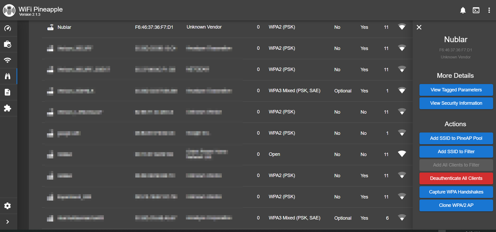
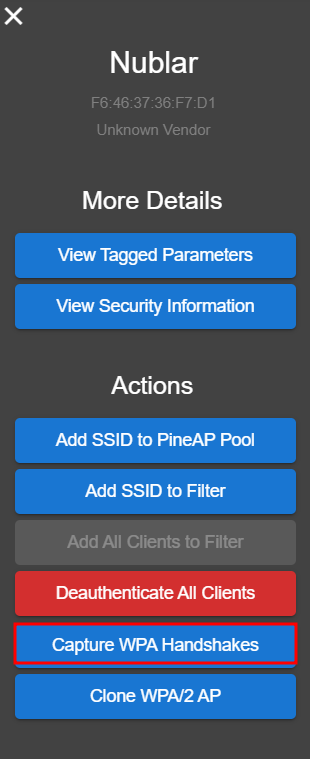
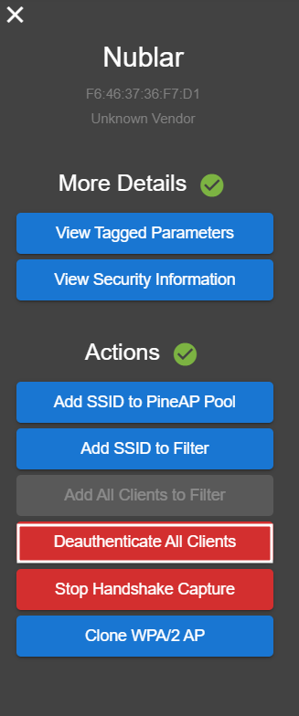

# Obtaining Wireless Passkey
---
To obtain the passkey, a "handshake" must be captured. The handshake is the authentication procedure for a client and an AP. If this handshake is captured, an operator can then use various tools in order to start the process of cracking the wireless passkey. 

## Handshake Capture Procedure using Recon
---
1. Obtain MP SSID for capture. In this example `Nublar` is the intended target. After obtaining the SSID, navigate to the `Recon` tab on the Pineapple dashboard and start the recon scan. 
2. After locating and selecting the intended target on the Recon results, select the SSID, then ensure to select "Capture WPA Handshakes" in the sidebar that appears. Once selected, it will turn red and a notification will appear saying the capture has started.
3. While capturing, select the "Deauthenticate All Clients". A message may appear stating that there are no associated clients, click "Deauthentictate".
   
   
   
4. As clients are temporarily booted off the target SSID, the Pineapple may capture some handshakes. If any are captured, there will be a notification and results appearing in the "Handshakes" tab on the recon page. 
5. From the "Handshakes" tab, you should be able to download either a `PCAP` or `22000` file for use with Hashcat. Results may say "Partial Handshake"; it remains possible to crack the passkey with a partial handshake, but if possible, run the deauthenticate again in effor to capture a full handshake. 
6. If cracking locally with hashcat, a simple command would be `$ hashcat -m 22000 hash.hc22000 wordlist.txt` substituting a different wordlist

## Handshake Capture Using EvilAP
---
1. Operators have the ability to also use the EvilWPA to capture handshakes. EvilWPA is the access point intended to impersonate the target AP. Navigate to the `PineAP` tab on the dashboard. 
2. Navigate to the EvilWPA tab. Fill in the information that you want to spoof and hit save. Ensure that if you intend on capturing handshakes that the "Capture Handshakes" is enabled. 
