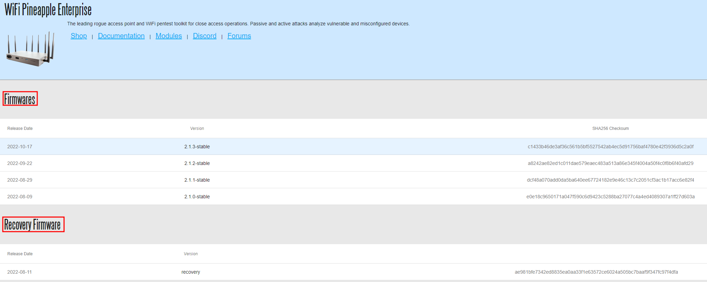
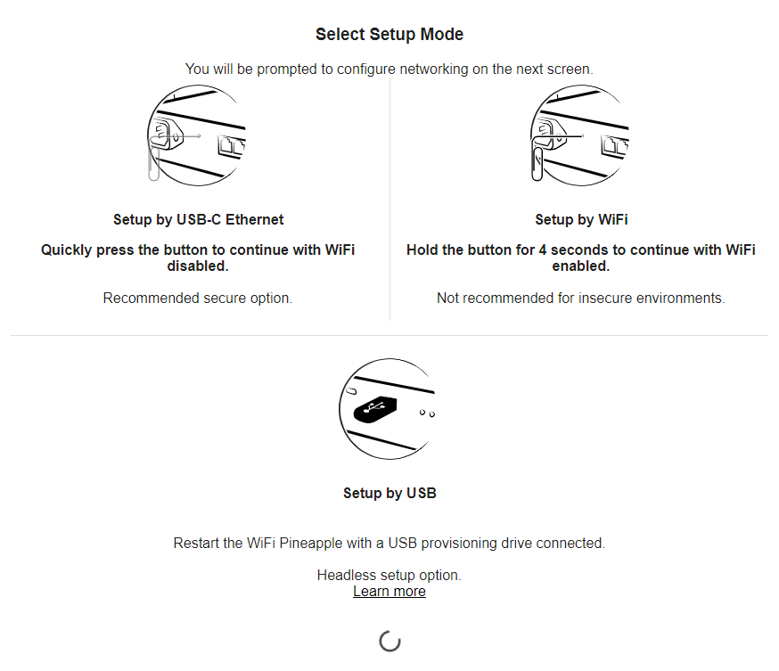
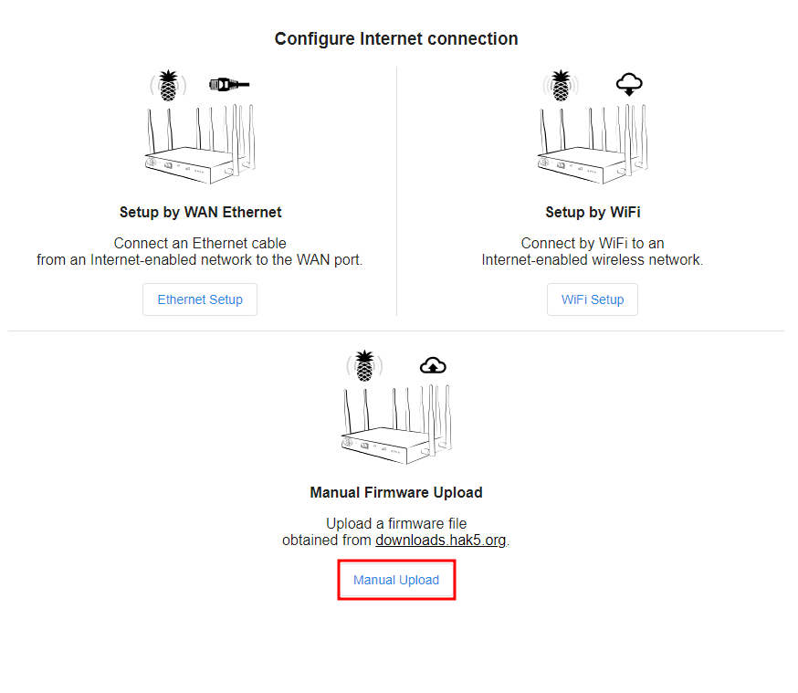
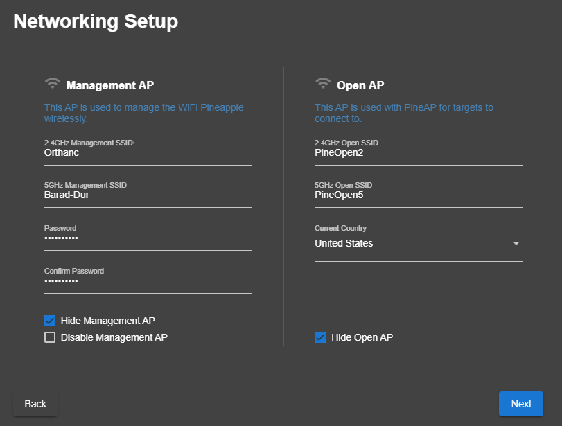
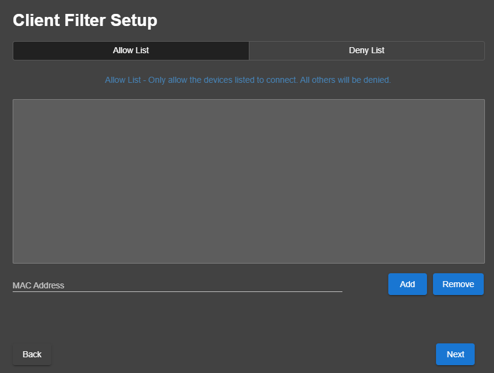
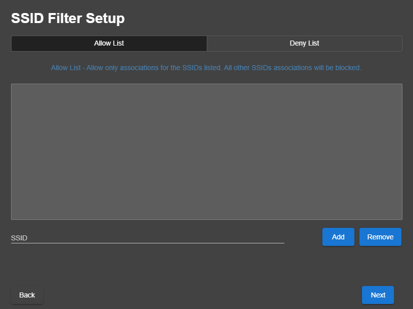

# Preparation
---
1. Browse to https://downloads.hak5.org/pineapple/ent1 and download both the `Recovery Firmware` and the `Production Firmware` .bin files. It's important to download both as the `Recovery Firmware` .bin is used to initialize the reset process and the `Production Firmware` is used to ensure the Pineapple has the proper software for use. 
	**Note Armory/Support may include backup USB with firmware to include in kit; link is used to pull in emergency**

2. 🛑 **Warning:** Connect antenna's before power on the WiFi Pineapple. Not doing so may damage radio's. Connect the USB cable to the Pineapple and the analyst machine.
3. While holding the the reset button on the back of the Pineapple, power on the Pineapple.
	With the reset button held, the WiFi Pineapple Enterprise will show the following LED indications:
	- Four white solid LEDs    
	- One blue solid LED    
	- One blue solid LED and one blinking red LED   
	**Immediately** after the red LED begins blinking, **release the reset button**.
4. The LED indication should remain with one LED solid blue, one LED blink **RED**, and two LED's off. If the status LED changes before the firmware recovery is uploaded from the web interface, disconnect the power and repeat the above process being sure to release the reset button immediately after the red LED begins blinking.
5. Assign static IP to analyst laptop `172.16.42.42`; see [Connecting to the Pineapple](Connecting to the Pineapple ) page for further instructions
6. Once a static IP address has been assigned, open your browser and navigate to [http://172.16.42.1](http://172.16.42.1/). You'll then be directed by a screen prompting you to upload a **.bin image**. Ensure that the `Recovery` .bin is used at this stage.
7. Once the process is complete, 5-10 minutes, you should begin the Setup Phase

# Factory Resetting cont.
---
1. Select the `Recovery` .bin and select "Update Firmware".

 2. After completion, no notification will be sent, but when you can navigate to http://172.16.42.1:1471
 3. After navigating to the above webpage, select the "Setup by USB-C Ethernet:
4. Select "Manual Upload". On the next page, select "Choose File" and select the `Production Firmware`.bin found in the "Preparation" section of "Resetting the Pineapple"
# Setup
---
1. After clicking "Begin Setup", select "Continue with Radios Disabled". This ensures no wireless networks are broadcast publicly; these will be enabled later.
2. Ensure standard Assess Password is used. This password is for management access to the Pineapple, username will be `root`. Select time zone where mission is taking place. 
3. On the Networking Setup page, there are two sections: `Management AP` and `OpenAP`. The management AP is for operators to connect to in order to manage the Pineapple wirelessly. The OpenAP is to serve a basic, unencrypted Open access point, or automatically impersonate any Open access point requested by a client. Note the name and password you assign to each and ensure to check both "Hide Management AP" and "Hide Open AP". These options can be reversed later, but should be hidden during setup of the device.
4. The next page is the "Client Filter Setup" page. On this page, you have the option to only allow certain clients to connect to the device or deny certain clients the ability to connect. These lists leverage a device's MAC address. This page may or may not be used, depending on MP scoping/requests.

6. The next page, "SSID Filter Setup" is similar to the previous page. It is used to either only allow certain SSIDs to associated or deny certain SSIDs to be associated.
7. Select theme for the interface and accept both "Terms of Service" & "License Agreement" and select "Finish". You are then redirected to the dashboard interface of the Pineapple. Again, use root and the standard Assess password set in step 2.
8. Upon initial login, you may notice a notification that states the Pineapple isn't connected to the internet. This isn't necessary for usage however if the mission partner has provided access to either a WAP or extra physical port to connect to, feel free to select appropriate option for connectivity.
9. The Pineapple setup is now complete. 
