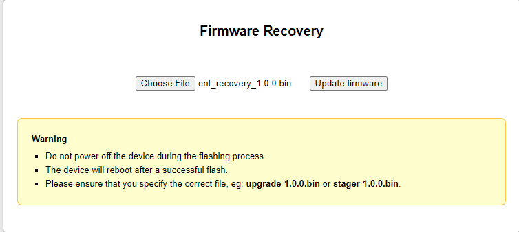

# Preparation
---
Powering on the Pinapple
1. 🛑 **Warning:** Connect antenna's before powering on the WiFi Pineapple. Not doing so may damage radio's. Connect the USB cable to the Pineapple and the analyst machine.
2. While holding the the reset button on the back of the Pineapple, plug in the power cord to power on the Pineapple.
	With the reset button held, the WiFi Pineapple Enterprise will show the following LED indications:
	- Four white solid LEDs    
	- One blue solid LED    
	- One blue solid LED and one blinking red LED   
	**Immediately** after the red LED begins blinking, **release the reset button**.
3. The LED indication should remain with one LED solid blue, one LED blink **RED**, and two LED's off. If the status LED changes before the firmware recovery is uploaded from the web interface (completed in next section), disconnect the power and repeat the above process being sure to release the reset button immediately after the red LED begins blinking.

# Updating & Factory Resetting the Pineapple
---
1. Browse to https://downloads.hak5.org/pineapple/ent1 and download both the latest `Recovery Firmware` and the `Production Firmware` .bin files. It's important to download both as the `Recovery Firmware` .bin is used to initialize the reset process and the `Production Firmware` is used to ensure the Pineapple has the proper software for use.
	**Note Armory/Support may include backup USB with firmware to include in kit; link is used to pull in emergency**

2. Assign static IP to analyst laptop `172.16.42.42`; see [Connecting to the Pineapple](Connecting to the Pineapple ) page for further instructions
3. Open your browser and navigate to [http://172.16.42.1](http://172.16.42.1/). 
4. Select the `Recovery` .bin and select "Update Firmware".
   	**This takes 5-10 minutes and no notification is given in the window when complete. You must wait until the lights on the pineapple shows 2 solid blue, and 1 green**

 6. Navigate to http://172.16.42.1:1471
 7. Login with root and standard assess password.
 8. Use the option to "Setup by USB-C Ethernet" by quickly pressing and releasing the reset button on the Pineapple as shown below:
9. Select "Manual Upload". On the next page, select "Choose File" and select the `Production Firmware`.bin you downloaded earlier and press the Upload button. This will take a few minutes. You will see the Welcome screen once it is complete.
# Setup
---
1. Click "Begin Setup" and select "Continue with Radios Disabled". This ensures no wireless networks are broadcast publicly; these will be enabled later.
2. On the **General Setup** screen, ensure the Standard Assess Password is used. This password is for management access to the Pineapple, username will be `root`.
3. Select time zone where mission is taking place and click **Next**
4. On the **Networking Setup** screen, there are two sections: `Management AP` and `OpenAP`. The management AP is for operators to connect to in order to manage the Pineapple wirelessly. The OpenAP is to serve a basic, unencrypted Open access point, or automatically impersonate any Open access point requested by a client. Note the name and password you assign to each and ensure to check both "Hide Management AP" and "Hide Open AP". These options can be reversed later, but should be hidden during setup of the device. Name your APs and click **Next**
5. On the **Client Filter Setup** screen, you have the option to only allow certain clients to connect to the device or deny certain clients the ability to connect. These lists leverage a device's MAC address. This page may or may not be used, depending on MP scoping/requests. You can always return later after the setup is complete to edit these lists.
   

5. On the **SSID Filter Setup** screen, you have the option to allow or deny certain SSIDs. You can always return later after the setup is complete to edit these lists.
6. On the **Look and Feel** screen, select a theme for the interface and press the **Next** button.
7. Accept both "Terms of Service" & "License Agreement" and press the **Finish** button. You are then redirected to the dashboard interface of the Pineapple. Again, use root and the standard Assess password set in step 2.
8. Login with **root** and the password you set earlier (It should have been the standard assess password). **Upon initial login, you may notice a notification that states the Pineapple isn't connected to the internet. This isn't necessary for usage however if the mission partner has provided access to either a WAP or extra physical port to connect to, feel free to select appropriate option for connectivity.
9. The Pineapple setup is now complete. 
