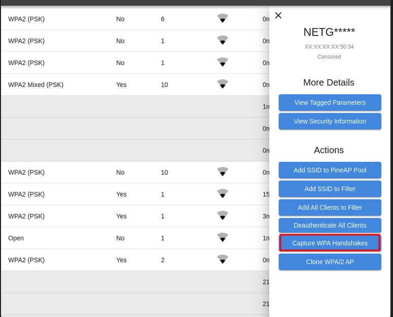

### Automatic Handshake Capture

Handshakes are part of normal WiFi traffic when a client joins or refreshes a network.

The WiFi Pineapple can automatically collect handshakes which are caught during a recon scan, with no extra effort.

Automatic handshake capture can be enabled in the Recon panel.

---
### Direct Handshake Capture

A specific network may be targeted for handshake capture by selecting the network, then selecting "Capture Handshakes" from the menu:
Directed handshake capture parks the WiFi Pineapple on the same channel as the target device and waits for handshake packets. Remaining on the target channel increases the chances of capturing a complete handshake.

Causing clients to reconnect by using the "Deauthenticate All Clients" option, or deauthenticating a specific client, can increase the chances of capturing a handshake.

---
### EvilWPA Handshakes

The EvilWPA access point clone is able to capture partial handshakes presented by a client, even when it is not possible to fully authenticate the client.

These half-handshakes can be leveraged by hashcat or HASHTOPOLIS to attack the original passphrase.