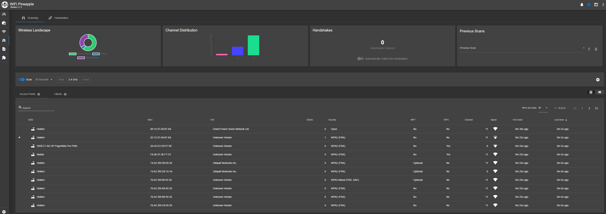
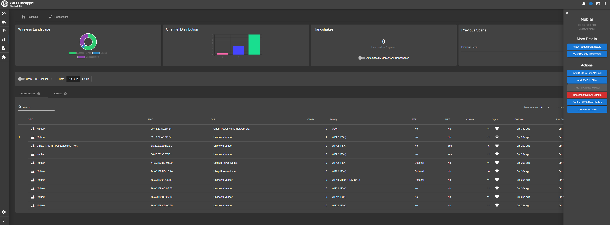

The WiFi Pineapple has the ability to perform recon in the WiFi landscape.

From the Dashboard, select `Recon` from the sideboard. It will direct you to a web page that gives a broad overview.

On the main Recon page, you can see an at-a-glance overview of the current wireless landscape, with a list of discovered APs and their associated clients, and all clients which have been discovered.

Clicking on a column header allows sorting by that column. The number of Access Points or Clients shown can be controlled by the **Page Size** option below the view.

You can search for Access Points or Clients by SSID, BSSID, or MAC address via the **Search** field below the view.

In the Access Point view, if clients have been discovered on an Access Point, clicking the **+** icon for that row will expand the row and show the list of clients. Clicking on the **-** icon will collapse an expanded row.

By clicking on an AP or Client in the list, a side menu will slide out from the right. From here you can select options specific to the type of device you selected, such as capturing handshakes or cloning, or adding MAC addresses to the Filters.

### Deauthenticating Networks and Clients
---

Deauthenticating clients sends a forged WiFi packet which indicates that the client is no longer authorized on the access point.

The WiFi Pineapple can deauthenticate all clients on an access point, or specific single clients.

Deauthenticating a client can be used to migrate the client to another access point.. It can also be used to cause a client to reconnect to a network, generating a WPA Handshake.

Deauthenticating clients and networks is not possible when:

- The client or network uses MFP, or Management Frame Protection. MFP is an extension to the WiFi standards which is designed to prevent impersonation of an access point. This prevents forged deauthentication packets from being respected by the client.
    
- The client or network is on a restricted channel. The FCC and other regulatory bodies around the world enforce extremely strict limits on part of the 5GHz band known as DFS / UNII-2 / UNII-2e which prohibits transmission on these frequencies if not communicating with an access point.
    

When there are no clients on the network, the WiFi Pineapple will issue a warning, but you may choose to attempt to disassociate clients which may be present and have not been observed by sending a broadcast disassociation to all possible clients.

