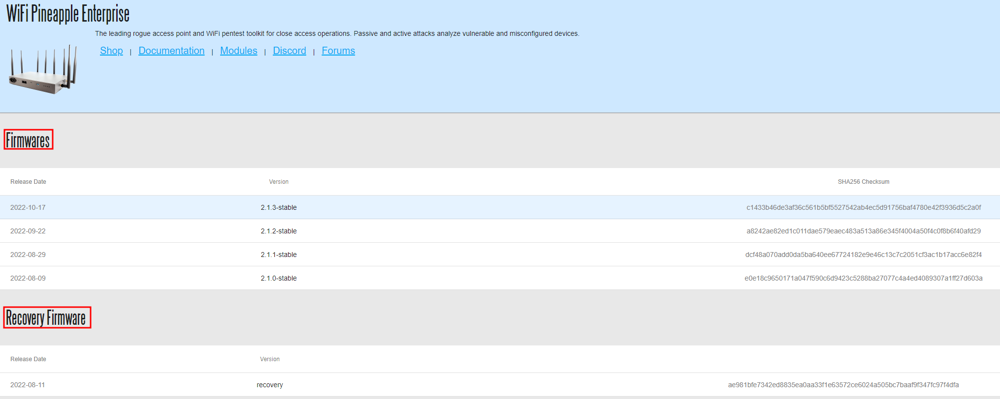

# Preparation
---
1. Browse to https://downloads.hak5.org/pineapple/ent1 and download both the `Recovery Firmware` and the `Production Firmware` .bin files. It's important to download both as the `Recovery Firmware` .bin is used to initialize the reset process and the `Production Firmware` is used to ensure the Pineapple has the proper software for use. 
	**Note Armory/Support may include backup USB with firmware to include in kit; link is used to pull in emergency**

2. 🛑 **Warning:** Connect antenna's before power on the WiFi Pineapple. Not doing so may damage radio's. Connect the USB cable to the Pineapple and the analyst machine.
3. While holding the the reset button on the back of the Pineapple, power on the Pineapple.
	With the reset button held, the WiFi Pineapple Enterprise will show the following LED indications:
	- Four white solid LEDs    
	- One blue solid LED    
	- One blue solid LED and one blinking red LED   
	**Immediately** after the red LED begins blinking, **release the reset button**.
4. The LED indication should remain with one LED solid blue, one LED blink **RED**, and two LED's off. If the status LED changes before the firmware recovery is uploaded from the web interface, disconnect the power and repeat the above process being sure to release the reset button immediately after the red LED begins blinking.
5. Assign static IP to analyst laptop `172.16.42.42`; see "Setting up the Pineapple Page" for further instructions
6. Once a static IP address has been assigned, open your browser and navigate to [http://172.16.42.1](http://172.16.42.1/). You'll then be directed by a screen prompting you to upload a **.bin image**. Ensure that the `Recovery` .bin is used at this stage.
7. Once the process is complete, 5-10 minutes, you should begin the Setup Phase