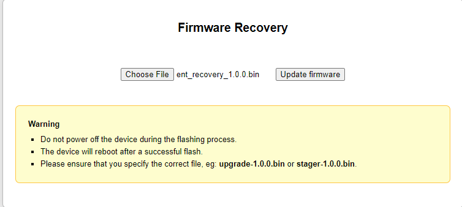
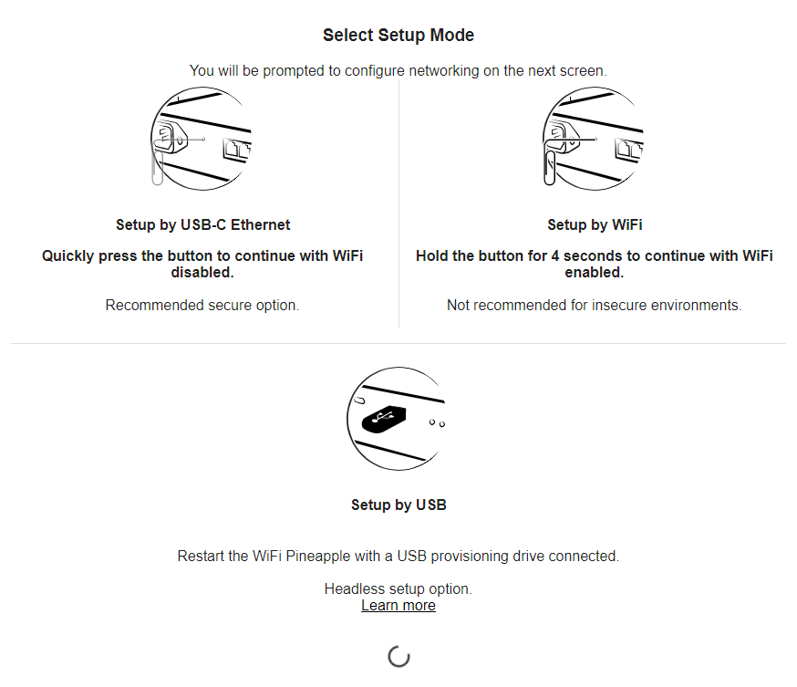
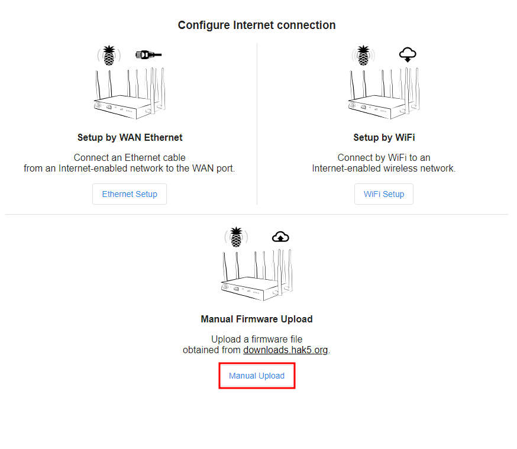
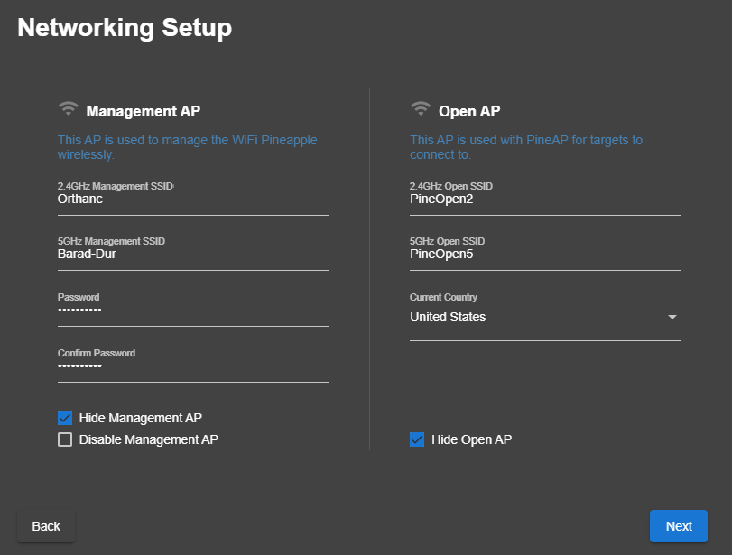
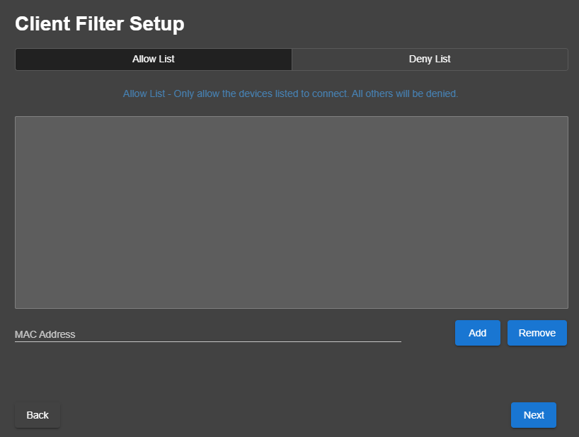
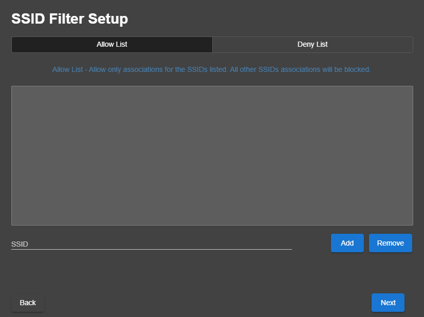

# Factory Resetting cont.
---
1. Select the `Recovery` .bin and select "Update Firmware".

 2. After completion, no notification will be sent, but when you can navigate to http://172.16.42.1:1471
 3. After navigating to the above webpage, select the "Setup by USB-C Ethernet:
4. Select "Manual Upload". On the next page, select "Choose File" and select the `Production Firmware`.bin found in the "Preparation" section of "Resetting the Pineapple"
# Setup
---
1. After clicking "Begin Setup", select "Continue with Radios Disabled". This ensures no wireless networks are broadcast publicly; these will be enabled later.
2. Ensure standard Assess Password is used. This password is for management access to the Pineapple, username will be `root`. Select time zone where mission is taking place. 
3. On the Networking Setup page, there are two sections: `Management AP` and `OpenAP`. The management AP is for operators to connect to in order to manage the Pineapple wirelessly. The OpenAP is to serve a basic, unencrypted Open access point, or automatically impersonate any Open access point requested by a client. Note the name and password you assign to each and ensure to check both "Hide Management AP" and "Hide Open AP". These options can be reversed later, but should be hidden during setup of the device.
4. The next page is the "Client Filter Setup" page. On this page, you have the option to only allow certain clients to connect to the device or deny certain clients the ability to connect. These lists leverage a device's MAC address. This page may or may not be used, depending on MP scoping/requests.
5. The next page, "SSID Filter Setup" is similar to the previous page. It is used to either only allow certain SSIDs to associated or deny certain SSIDs to be associated.
6. Select theme for the interface and accept both "Terms of Service" & "License Agreement" and select "Finish". You are then redirected to the dashboard interface of the Pineapple. Again, use root and the standard Assess password set in step 2.
7. Upon initial login, you may notice a notification that states the Pineapple isn't connected to the internet. This isn't necessary for usage however if the mission partner has provided access to either a WAP or extra physical port to connect to, feel free to select appropriate option for connectivity.
8. The Pineapple setup is now complete. 